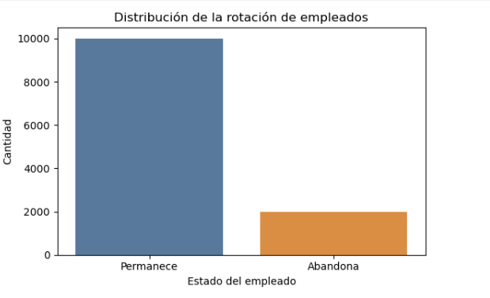
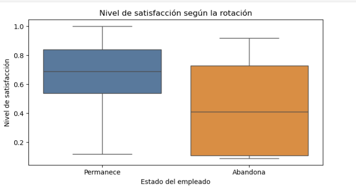
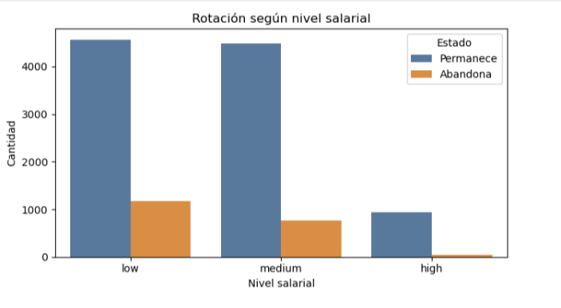
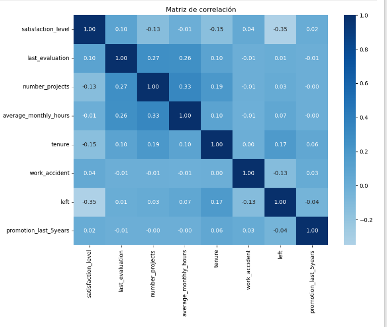
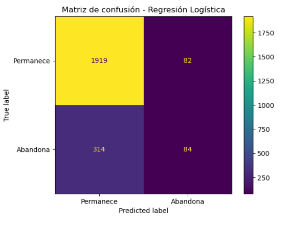

# 🏢 Salifort Motors - Predicción de Rotación de Empleados

## 📌 Descripción del proyecto

Este proyecto analiza los factores asociados a la rotación de empleados en Salifort Motors utilizando técnicas de Análisis Exploratorio de Datos (EDA) y modelos de Machine Learning.

El objetivo es identificar las variables que influyen en la salida de empleados y entregar información útil para apoyar la toma de decisiones del área de Recursos Humanos.

---

## 🎯 Objetivos

- Analizar el comportamiento de los empleados.
- Identificar factores asociados a la rotación.
- Construir modelos predictivos.
- Comparar el rendimiento de distintos algoritmos.
- Entregar recomendaciones basadas en datos.

---

## 🛠 Tecnologías utilizadas

- Python
- Pandas
- NumPy
- Matplotlib
- Seaborn
- Scikit-learn
- XGBoost
- Jupyter Notebook

---

## 📂 Estructura del proyecto

```text
salifort-motors-employee-attrition/

├── data/
├── notebooks/
├── images/
├── README.md
├── requirements.txt
└── LICENSE
```

---

## 📈 Estado

🚧 Proyecto en construcción.

Próximamente se incorporarán:

- Análisis exploratorio de datos (EDA)
- Visualizaciones
- Modelos de Machine Learning
- Resultados
- Conclusiones
- Recomendaciones para el negocio

---

# 📊 Visualizaciones principales

## Rotación de empleados

Esta gráfica muestra la distribución de empleados que permanecieron en la empresa y aquellos que abandonaron la organización.



## Nivel de satisfacción

Comparación del nivel de satisfacción entre los empleados que permanecieron y quienes abandonaron la empresa.




## Rotación según salario

Distribución de la rotación de empleados según el nivel salarial.




## Matriz de correlación

Relación entre las principales variables analizadas durante el análisis exploratorio de datos.




## Matriz de confusión

Resultados del modelo de Machine Learning utilizados para evaluar el rendimiento del modelo predictivo.




